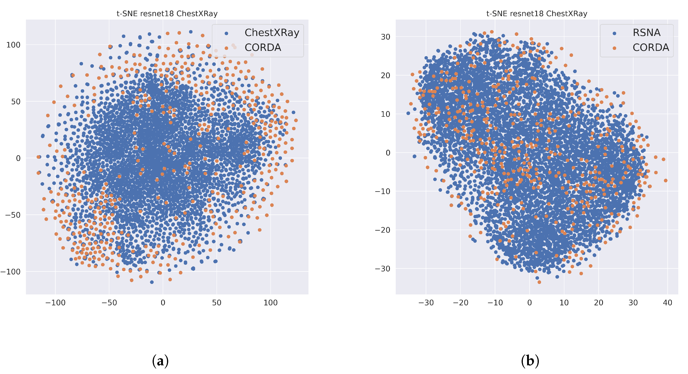

# Unveiling COVID-19 from CHEST X-Ray with Deep Learning: A Hurdles Race with Small Data

Enzo Tartaglione1, Carlo Alberto Barbano1, Claudio Berzovini2, Marco Calandri3, Marco Grangetto1 | [[pdf](https://www.mdpi.com/1660-4601/17/18/6933/htm)]

1University of Turin, Computer Science dept. 
2Azienda Ospedaliera Città della Salute e della Scienza, Turin, Italy 
3University of Turin, Oncology dept., AOU San Luigi Gonzaga, Orbassano, Italy 

The possibility to use widespread and simple chest X-ray (CXR) imaging for early screening of COVID-19 patients is attracting much interest from both the clinical and the AI community. In this study we provide insights and also raise warnings on what is reasonable to expect by applying deep learning to COVID classification of CXR images. We provide a methodological guide and critical reading of an extensive set of statistical results that can be obtained using currently available datasets. In particular, we take the challenge posed by current small size COVID data and show how significant can be the bias introduced by transfer-learning using larger public non-COVID CXR datasets. We also contribute by providing results on a medium size COVID CXR dataset, just collected by one of the major emergency hospitals in Northern Italy during the peak of the COVID pandemic. These novel data allow us to contribute to validate the generalization capacity of preliminary results circulating in the scientific community. Our conclusions shed some light into the possibility to effectively discriminate COVID using CXR.

